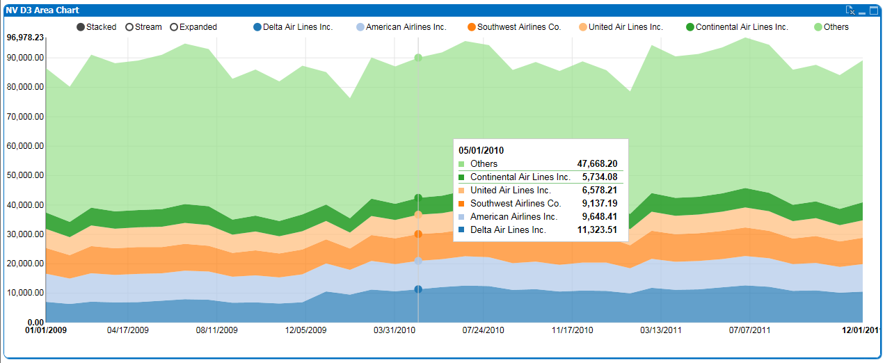
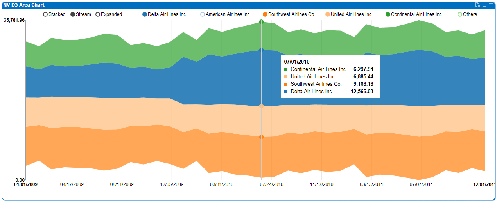
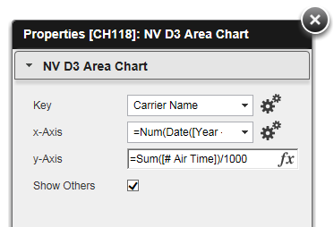

QlikView Extension NVD3AreaChart
================================

This extension implements NVD3 interactive stacked area chart: http://nvd3.org/examples/stackedArea.html

Properties:
-----------

1. Key	      : 1st Dimensions, key for the stream, limited to 5 keys (OtherCounted=6), use a descent sort order by expression
2. x-Axis     : 2nd Dimensions, date for timeline, a QlikView date as number needed: =Num(DateField)
3. y-Axis     : Measure to display
4. y-Axis d3 format: d3 format code (w/o quotes, default = ',.2f'), use '.0%' from percentages
5. Show Others: Show 'Others' aggregation (6th key in 1st Dimension)
